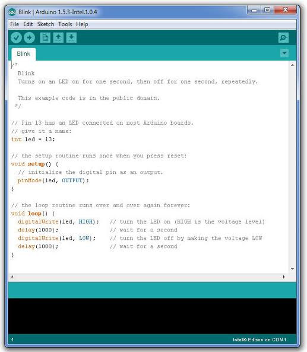
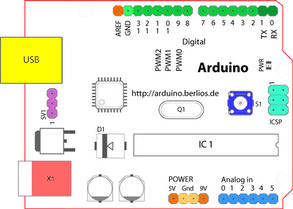
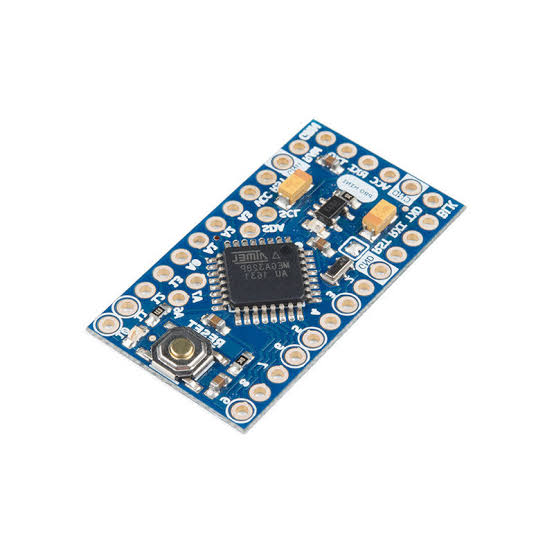
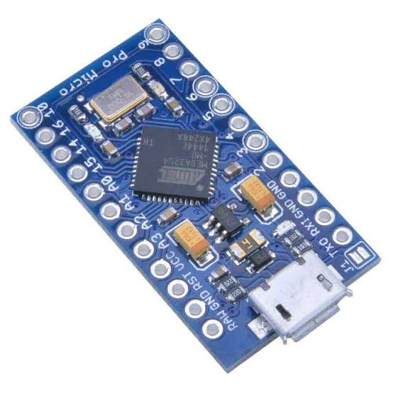
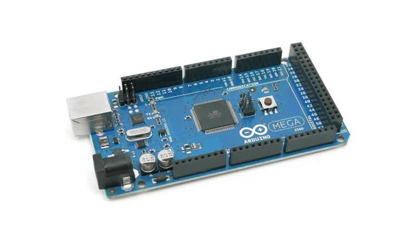
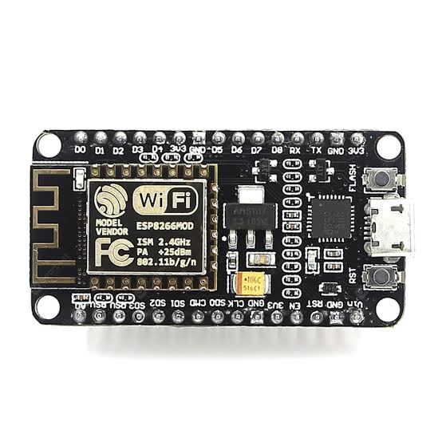
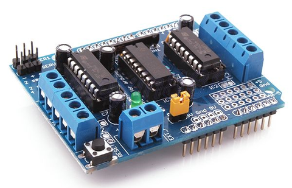
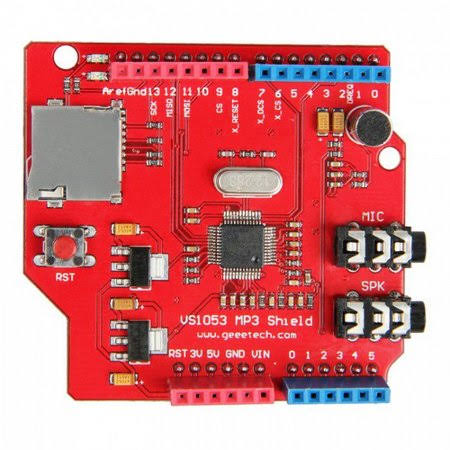
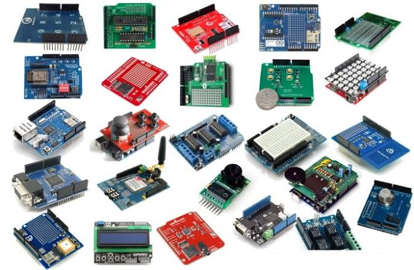

# Aula 2 - Arduino, placas de desenvolvimento, instalação da IDE.

## Conteúdo

Neste semestre faremos alguns projetos com o arduino, que nos fornece um ambiente completo para trabalhar com microcontroladores. O arduino se trata de um projeto opensource, realizado inicialmente por uma empresa italiana, mas que hoje já apresenta no mercado outras fabricantes que produzem placas similares (já que os modelos de hardware são abertos e podem ser copiados sem maiores implicações). Um arduino não é simplesmente um microcontrolador, mas sim uma placa de desenvolvimento que possui nela um microcontrolador e algumas outras peças, com a finalidade de facilitar o nosso trabalho. O processo para programar microcontroladores "na mão" é bem mais complexo, pois geralmente precisaríamos montar um circuito e ter algumas ferramentas mais específicas. Está aí a importância do arduino, que tornou para nós o processo muito mais simples e descomplicado.

Sem o arduino:

Com arduino:

O Arduino pode ser alimentado por uma fonte de 9v ou por um cabo serial-usb (brotip: muitas impressoras utilizam este cabo). Durante a realização de qualquer projeto, precisamos realizar a troca de dados entre o arduino e o computador e, para isso, fazemos o uso do cabo serial. A fonte ou bateria de 9v será usada para o funcionamento do projeto já realizado (quando não precisamos trocar dados). O Arduino usa C++ como linguagem padrão, mas existem alternativas, como por exemplo: python, ADA, basic, entre outros. Apesar de serem possibilidades, estas porém são menos documentadas e a comunidade não é tão grande, além de poderem não ser tão performáticas, então talvez crie para você alguma dificuldade. Por isso, focaremos no C++!

O arduino apresenta alguns pinos (a quantidade muda de acordo com o modelo), sendo a função desses pinos fazer conexões baseadas em input e output.

* `Pinos analógicos`: são prefixados com um A maiúsculo. Ex: A1, onde os valores de suas medições podem variar de 0 a 1023, ou seja um número de 10 bit;

* `pinos digitais`: são representados apenas por números. Ex: 13, e os valores de medição são binários (0 e 1);

* `pinos PWM`: são tanto pinos prefixados `~` como pinos digitais, capazes de simular um sinal analógico (veremos mais sobre isso na aula de eletrônica básica);

* `pinos de alimentação`: com estes, podemos alimentar nosso circuito ou sensores com `3.3v`, `5v` ou `Vin` (que tem um pouco menos de 9v, basicamente a mesma tensão de entrada do arduino) e o pino `GND` (Ground) que é o terra.

* `pinos RX e TX`: servem para receber e enviar dados via serial.

Temos também [outros](https://www.arduino.cc/en/reference/board) pinos, que veremos no decorrer de nossas atividades, embora não sejam tão utilizados.

Segue abaixo como funciona o esquema de pinagem do arduino uno:

Temos uma gama enorme de modelos disponíveis, entre eles muitos que não são da empresa Arduino propriamente dita. Na sequência veremos alguns modelos e suas características.

* `Arduino Uno` - Sendo o mais conhecido de todos, este é um modelo bem simples e barato. Como é muito indicado para aqueles que estão começando e possuem uma quantia razoável de pinos, porém não possuem muitos recursos especiais, nós o usaremos em quase todos os nossos projetos. Este modelo usa o microcontrolador ATmega328, que é produzido pela Atmel, e opera na frequência de 16MHz, contando com 14 pinos de entrada e de saída (input e output). Dos pinos de entrada e saída citados, 6 podem ser usados para PWM (pulse width modulation) e, do outro lado, haverá 6 pinos analógicos. Ele apresenta também 32KiB de memória flash, onde os programas são armazenados, e tem 2KiB de RAM.

AVISO: Cuidado ao ligar sensores de 3.3v em pinos de input e output, pois esses pinos operam com 5v e, tentando fazer essa ligação, você poderá danificar alguma coisa.

Hoje possuímos dois tipos disponíveis desse modelo, sendo: os que são PTH (plate through hole), em que você pode remover o microcontrolador; e o SMD (surface mount device), que possui o microcontrolador já soldado na placa. Apesar da diferença citada, ambos funcionam da mesma maneira.

* `Arduino pro mini` - Este modelo é bem conhecido pelo seu tamanho, pois são bem pequenos e geralmente usados para projetos mais discretos, como o Rubber Ducky, teclados mecânicos, etc. Ele possui versões de 3.3v e 5v, sendo que o de 3.3v opera na frequência de 8MHz, e o de 5v com 16MHz. Vale salientar que ele não possui as entradas fêmeas, o que significa que você precisará soldar algumas coisas. Além disso, este modelo também não apresenta USB, então para programa-lo você precisará de um FTDI ou cabo serial.

* `Arduino pro micro` - Este modelo lembra bastante o arduino pro mini, porém com um ponto de diferença: por apresentar o suporte a USB, este arduino facilita bastante o nosso trabalho, uma vez que não precisaremos de nenhum cabo especial para programa-lo. Ele também usa outro chip, o ATmega32U4, além de ser composto por 12 pinos de IO, onde 5 são PWM, 4 são analógicos. Conta ainda com 32KiB de memória flash e 2.5KiB de RAM. Assim como o pro mini, ele também se apresenta nas versões de 3.3v e 5v.

* `Arduino Mega 2560` - Um dos maiores modelos disponíveis da categoria, este é muito utilizado em impressoras 3D, cortadoras a laser e CNC&#39;s. Ele opera com 16MHz, tendo 54 pinos de IO, onde 15 são PWM, 16 são analógicos, além de incríveis 256KiB de memória flash, 8KiB de RAM e 4 portas seriais.

* `Esp8266` - Apesar do modelo não pertencer à empresa Arduino, ele se destaca por seu tamanho pequeno e pela quantidade enorme de recursos que já vem embutidas em suas funções, não precisando ser compradas a parte, como, por exemplo, o módulo de wifi, 520 KiB SRAM de memória, que se sobressai à capacidade de alguns arduinos. O upload do código para a placa é um pouco mais complexo e algumas funções se apresentam um pouco diferentes das que estão presentes em arduinos convencionais. Sendo assim, sempre que usar um ESP, é muito importante verificar se a lib que será utilizada suportará o seu dispositivo. Este modelo opera com 3.3v na frequência de 80 MHz.

* `Esp32` - Este modelo é o sucessor do ESP8266, já apresentando suporte para bluetooth e BLE (versão mais nova do bluetooth, que gasta menos energia). Ele possui 520 KiB de memória flash, sendo ainda disponibilizado em duas versões de processadores, sendo eles: 32-bit LX6 microprocessador, que possui apenas um core como as outras placas vistas antes; e um com o microprocessador Xtensa dual-core, que tem mais poder de processamento (o que nos abre portas para experiências bastante diferentes, como realizar operações em paralelo).

* `Teensy 2.0` -

* `SHIELDS`: São módulos que se conectam ao arduino para fazer algo de maneira fácil, sem que você tenha que montar um circuito completo, como por exemplo:

 - Controlar um motor:

 - Usar um chip de celular no seu projeto(GPRS):

 

 - Módulos MP3 para músicas:

 

 - E muitos outros...

 

Primeiro instale a IDE em sua máquina, acesse [esse link](https://www.arduino.cc/en/main/software) e faça o download de acordo com o seu sistema operacional.

Agora que já entendemos o básico do funcionamento do arduino, vamos alar um pouco sobre a IDE (Integrated Development Environment) do arduino. ma IDE nos oferece todo um ambiente de desenvolvimento, onde podemos compilar e enviar nosso código, debugar possíveis problemas, encontrar exemplos que nos ajudem a criar nossos projetos (servindo como inspiração e base), entre muitas outras ferramentas que acabam facilitando nosso trabalho. entre elas podemos citar algumas das principais funções:

* File -> Examples: Possui diversos exemplos para se inspirar.

* Sketch -> Add library: Instalar uma lib na sua máquina.

* Tools -> Board: Para escolher qual placa você está usando.

* Tools -> Serial Port: Escolhe a porta USB do computador que está ligado à porta serial do arduino. No caso do Linux, o padrão de nomenclatura para esse dispositivo é semelhante a `dev/ttyACM0`, e para Windows será `COM1`.

* Tools -> Auto Format: Identa seu código corretamente.

* Botão verify: Compila seu código para saber se existe algum erro, mas não o envia para a placa.

* Botão upload: Compila seu código e o envia para a placa.

Após fazer o upload de um código, podemos acompanhar a comunicação que acontece usando o monitor de porta serial que nos mostra tais informações em formato numérico/texto, ou através do serial plotter, que exibe os mesmos dados em forma de gráfico.

Monitor serial:

Serial plotter:

## Na pratica

blink e outro exemplo

## Desafio

### Tasklist

* [ ] Montar squad
* [ ] Criar um canal de comunicação

## Referências e recursos úteis

[Site oficial do arduino](arduino.cc/)

[Esquema eletrico do arduino](https://www.arduino.cc/en/uploads/Main/arduino-uno-schematic.pdf)

[Arduino Download](https://www.arduino.cc/en/Main/Software)

[Pinagem do arduino](https://www.arduino.cc/en/reference/board)

[Comparacao de modelos de arduino da sparkfun](https://www.youtube.com/watch?v=hjRSwBcLcSU)
