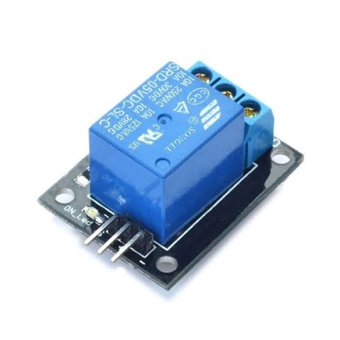

## Aula 7 - Projetos com alimentação externa.

## Conteúdo

Nesta aula, falaremos um pouco sobre projetos com alimentação externa e daremos início a uma introdução ao esp8266, conteúdo que usaremos no projeto da tranca.

Lembre-se de que, durante a aula 3, falamos sobre algo chamado referência. Quando tratamos de referências, é importante não esquecermos de ter sempre todos os nossos grounds conectados juntos, para assim ter a mesma referência do que é 0v.

Quando temos um projeto que depende de uma alimentação externa, seja ela por uma fonte ou direto da tomada, precisamos de algo para usar como interruptor, para assim podermos monitorar quando ligar ou desligar o que quisermos controlar. Para isso, podemos utilizar reles e transistores, sendo que, enquanto o rele é um dispositivo eletromecânico que, ao energizar um lado, fecha o circuito como se fosse um interruptor normal, o transistor funciona de maneira eletrônica (neste conteúdo, não nos aprofundaremos nele).

Um rele pode apresentar vários canais, que são entradas para conectar dispositivos que quisermos ligar. No exemplo, utilizaremos um rele 5v de 1 canal.

Para conectar do lado do arduino, o + vai no `5v`, o - no `gnd`, e o `S` vai em qualquer pino digital. No exemplo, iremos abrir e fechar a fechadura solenoide. Dessa forma, o gnd do solenoide irá direto no gnd da fonte de alimentação externa e a parte positiva da fonte irá no bourne do meio `COM` ou `VCC`.

Após o procedimento citado, teremos duas opções para ligar nossa fechadura, sendo: de um lado o NC e do outro o NO. Quando escolhermos a opção NO (`Normally Open`), o circuito somente será energizado ao enviar 5v para o pino S e, se escolhermos a opção NC (`Normally Closed`), o processo ocorrerá ao contrário. Como queremos nossa fechadura fechada até que ordenemos que ela se abra, iremos escolher o NO.




### Implementando no esp8266

O funcionamento da pinagem, no esp8266, ocorre de forma um pouco diferente e, por isso, vou deixar abaixo uma imagem com a referência dos pinos:


Neste caso, perceba que estamos usando o pino d4 (que na verdade é o pino GPIO 2), que declaramos abaixo. O gnd não possui diferença e, para alimentar os 5v do rele, usaremos o pino Vin, que apresenta a mesma tensão de entrada da placa (que, por padrão de usb, são 5v).

snipet:

```cpp
#define RELE 2

void abre() {
  Serial.println("Abrindo");
  digitalWrite(RELE, HIGH);
}

void fecha() {
  Serial.println("Fechando");
  digitalWrite(RELE, LOW);
}

void setup() {
  pinMode(RELE, OUTPUT);
  digitalWrite(RELE, LOW);
  Serial.begin(9600);
}

void loop() {
  abre();
  delay(1000);

  fecha();
  delay(1000);
}
```

Atenção: muito cuidado ao lidar com fontes de tensão externa, mesmo que se trate de uma baixa tensão. Sempre desligue tudo antes de trocar conexões, manuseando o material com total segurança!

## Comentar sobre baterias em serie e paralelo


## Desafio

### User story

Para finalizar o projeto da horta, você deve implementar a solenoide que irrigará de fato nosso jardim. Para isso, ative a solenoide utilizando um rele ligado a uma fonte de 12v.

### Tasklist

* [ ] Implementar rele.

* [ ] Refatorar o código e revisar com o grupo.

* [ ] Abrir o pull request no github com as alterações de hoje para o professor revisar.


## Referências e recursos úteis

[ESP8266 pinout](https://mechatronicsblog.com/esp8266-nodemcu-pinout-for-arduino-ide/)
[Tutorial de rele](https://blogmasterwalkershop.com.br/arduino/como-usar-com-arduino-modulo-rele-5v-1-canal/)
