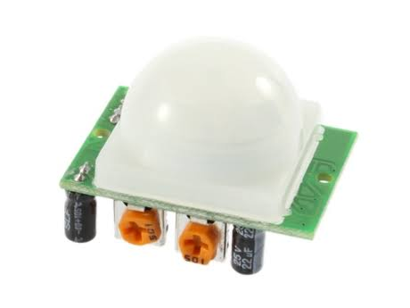

# Material IOT 2020 - VETERANOS

## Estrutura das aulas

Durante esse ano faremos alguns projetos de IOT, no primeiro semestre a ideia eh trabalhar em cima do device em si, enquanto no segundo semestre a ideia eh trabalhar com sua integração.

* `Monitoramento de hortas`:
Esse projeto visa criar uma maneira de coletar dados e diminuir o desperdício de água, colhendo informações sobre o jardim e irrigando-o automaticamente. Os dados coletados deverão ser exibidos em gráficos para o cliente final, para que este possa acompanhar se tudo está se desenvolvendo conforme o esperado.

* `Alimentador de pet`:
Para os donos de animais que ficam muito tempo fora de casa, seja por motivo de trabalho, estudo ou até mesmo viagens, esse projeto possibilita a estes pets o acesso a uma alimentação automatizada. Alguns requisitos sobre a abordagem ficarão em aberto para que os membros do time façam juntos a melhor escolha. Uma sugestão para este projeto é trabalhar com uma espécie de timer para criar uma rotina de alimentação para os animais, podendo ou não ser acionado manualmente.

### Primeiro semestre

Caso não possua um Arduino, você pode usar o [tinkercad](https://www.tinkercad.com) para emular um.

  - [Aula 1 - O que é IOT?](1-sem/01/README.md) intro

  - [Aula 2 - Arduino, placas de desenvolvimento, instalação da IDE.](1-sem/02/README.md) intro

  - [Aula 3 - Eletrônica básica.](1-sem/03/README.md) intro

  - [Aula 4 - Sensores e atuadores - pt1.](1-sem/04/README.md) bixo
prova
  - [Aula 5 - Sensores e atuadores - pt2.](1-sem/05/README.md) bixo e planta

  - [Aula 6 - Comunicação por HTTP.](1-sem/06/README.md) bixo
prova
  * [Aula 7 - Projetos com alimentação externa.](1-sem/07/README.md) planta

  - [Aula 8 - Tipos de motores e suas aplicacoes.](1-sem/08/README.md) bixo
prova
  - [Aula 9 - Comunicação por RF.](1-sem/09/README.md) bonus

  - [Aula 10 - Registradores.](1-sem/10/README.md) bonus

  - [Aula 11 - Interruptores.](1-sem/11/README.md) bonus

### Segundo semestre

Para o segundo semestre voce precisa apenas de um computador rodando qualquer distro do linux. Caso nao tenha um raspberry nao se preocupe. Caso esteja em duvida de qual distro instalar eu recomendo o debian buster(10).

  * [Aula 1 - Integrando nosso gadget.](1-sem/01/README.md)

  * [Aula 2 - Introdução ao Raspberry pi.](1-sem/02/README.md)

  * [Aula 3 - Comunicação entre Arduino e Raspberry por porta serial.](1-sem/03/README.md)

  * [Aula 4 - Protocolo HTTP.](1-sem/04/README.md)

  * [Aula 5 - Criando uma API.](1-sem/05/README.md)

  * [Aula 6 - Usando o docker para montar nosso stack.](1-sem/06/README.md)

  * [Aula 7 - Time series databases, Introdução ao InfluxDB.](1-sem/07/README.md)

  * [Aula 8 - Introdução à monitoração com Grafana.](1-sem/08/README.md)

  - [Aula 9 - Trabalhando com alertas no grafana.](1-sem/09/README.md)

  - [Aula 10 - Protocolo MQTT.](1-sem/10/README.md)

  - [Aula 11 - Protocolo BLE.](1-sem/11/README.md)

## Hardware

Para um melhor acompanhamento das aulas, é sugerido que tenha em mãos os itens listados abaixo. Para a montagem dos protótipos em si, ainda faltarão algumas peças, que podem ser facilmente improvisadas. Os itens a seguir serão listados pela ordem em que serão utilizados nas aulas.

Não se preocupe caso não tenha condições de adquirir todos os itens, pois pelo menos os essenciais, para serem utilizados em aula, serão levados pelo professor. Caso escolha usar as soluções virtualizadas, é importante ressaltar que temos alguns problemas de consistência, já que um emulador nunca apresentará os mesmos problemas de um hardware de verdade, tais como: problemas de tempo, de conexão, entre outros. Isso não torna as soluções virtuais inúteis, mas é importante ter isso em mente quando for desenvolver um projeto. Pode ser que no simulador ele funcione perfeitamente e, ao colocar para rodar de verdade, ele apresente algum problema. De qualquer forma, essa é a parte divertida do debug! :)

Segue a lista dos itens usados para os projetos:

* `Arduino Uno`

* `Cabo serial (muitas impressoras utilizam esse cabo, por isso talvez você o tenha em casa)`

* `Micro Servo 9g SG90 TowerPro`

* `Sensor de presença PIR DYP-ME003`

* `Sensor higrômetro (umidade de solo)`

* `Sensor de umidade e temperatura - DHT11`

* `Módulo Sensor de Luz LDR`

* `Rele 5v 1 canal`

* `Solenoide para irrigação (ou um solenoide simples para testes apenas)`

* `Protoboard 830 pontos`

* `Leds`

  - 5 LEDs Vermelhos
  - 5 LEDs Verdes

* `Resistores`

  - 10 Resistores de 300Ω
  - 10 Resistores de 220Ω
  - 10 Resistores de 10KΩ

* `Jumpers`

  - 20 Macho / Fêmea
  - 20 Macho / Macho (ou um pedaço de cabo de rede)

* `Raspberry Pi 3+`

* `Fonte universal com várias tensões e plugs`

O resto fica por conta da criatividade!
